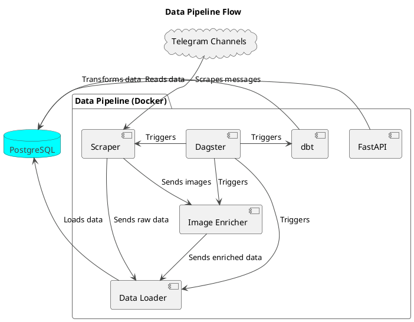
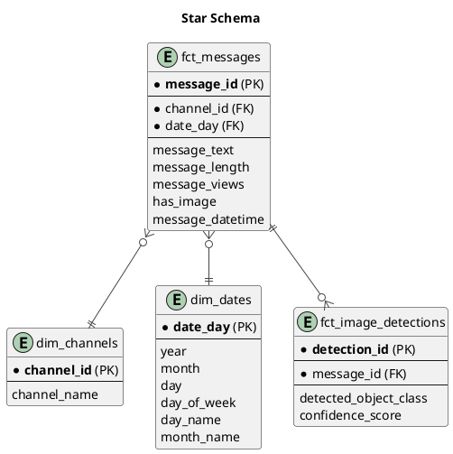

# Medical Product Data Pipeline

This project is a comprehensive data pipeline that automates the process of scraping medical product data from Telegram channels, enriching it with image analysis, loading it into a PostgreSQL database, and transforming it for analysis. The entire pipeline is orchestrated with Dagster and containerized with Docker for easy setup and deployment.

## Features

- **Automated Data Scraping:** Scrapes data from public Telegram channels using Telethon.
- **Image Enrichment:** Utilizes a YOLOv8 model to perform object detection on images, extracting valuable information about medical products.
- **Data Orchestration:** Leverages Dagster to define, schedule, and monitor the entire data pipeline.
- **Data Transformation:** Uses dbt to transform the raw data into a structured, analytics-ready format.
- **API Access:** Provides a FastAPI interface to expose the transformed data for further use.
- **Containerized Environment:** Docker and Docker Compose are used to ensure a consistent and reproducible environment.

## Architecture

The data pipeline is composed of the following components:

1.  **Scraper (`scraper.py`):** A Python script that uses the Telethon library to connect to Telegram and scrape messages from specified channels.
2.  **Image Enricher (`enrich_images.py`):** This script takes the scraped images and uses a pre-trained YOLOv8 model to detect and extract information about medical products.
3.  **Data Loader (`load_to_postgres.py`):** Loads the raw scraped data and the enriched image data into a PostgreSQL database.
4.  **dbt Transformation (`my_project/`):** A dbt project that contains models to transform the raw data into a structured format, creating dimensions and fact tables.
5.  **Dagster Orchestration (`pipeline.py`):** A Dagster pipeline that defines the assets, jobs, and schedules for the entire data flow, ensuring that each step is executed in the correct order.
6.  **FastAPI (`api/`):** A FastAPI application that provides an API to access the transformed data from the PostgreSQL database.
7.  **Docker (`Dockerfile`, `docker-compose.yml`):** The entire application is containerized, allowing for easy setup and deployment.

### Data Pipeline Diagram



> You can view this diagram using a PlantUML viewer like the [official online server](https://www.plantuml.com/plantuml/uml/SoWkIImgAStDuNBAJrBGjDGrAGXAJw6XAGU5B2a0L04eAAbL2Lg2oKi10000).

### Star Schema Diagram



> You can view this diagram using a PlantUML viewer like the [official online server](https://www.plantuml.com/plantuml/uml/SoWkIImgAStDuL9LqDGrAGXAJw6XAGU5B2a0L04eAAbL2Lg2oKi10000).

## Getting Started

These instructions will get you a copy of the project up and running on your local machine for development and testing purposes.

### Prerequisites

- Docker
- Docker Compose

### Installation

1.  **Clone the repository:**

    ```bash
    git clone https://github.com/AbenezerWork/Medical-Product-Data-Pipeline.git
    cd Medical-Product-Data-Pipeline
    ```

2.  **Set up the environment variables:**

    Create a `.env` file by copying the example file:

    ```bash
    cp .env.example .env
    ```

    Then, fill in the required values in the `.env` file. This will include your Telegram API credentials, database connection details, and any other secrets required by the pipeline.

3.  **Build and run the Docker containers:**

    ```bash
    docker-compose up -d --build
    ```

    This command will build the Docker image, start the `app` and `db` services, and run the Dagster UI and FastAPI application in the background.

## Usage

The data pipeline is orchestrated by Dagster and is scheduled to run automatically every day at midnight. However, you can also manually trigger the pipeline or individual components.

### Accessing the Dagster UI

The Dagster UI is available at [http://localhost:3000](http://localhost:3000). From the UI, you can:

-   Monitor the status of the pipeline runs.
-   Manually trigger the `all_assets_job` to run the entire pipeline.
-   View the asset catalog and the dependencies between them.
-   Inspect the logs for each step of the pipeline.

### Running the Pipeline Manually

To run the entire pipeline manually, you can trigger the `all_assets_job` from the Dagster UI. Alternatively, you can use the following command:

```bash
docker-compose exec app dagster job execute -f pipeline.py -j all_assets_job
```

### Accessing the API

The FastAPI application provides an API to access the transformed data. The API documentation is available at [http://localhost:8000/docs](http://localhost:8000/docs).

## Project Structure

```
.
├── api/                 # FastAPI application
├── data/                # Raw and enriched data
├── my_project/          # dbt models for data transformation
├── .env.example         # Example environment variables file
├── docker-compose.yml   # Docker Compose configuration
├── Dockerfile           # Docker configuration
├── enrich_images.py     # Script for image enrichment
├── load_to_postgres.py  # Script to load data into PostgreSQL
├── pipeline.py          # Dagster pipeline definition
├── README.md            # This file
├── requirements.txt     # Python dependencies
└── scraper.py           # Script to scrape data from Telegram
```
